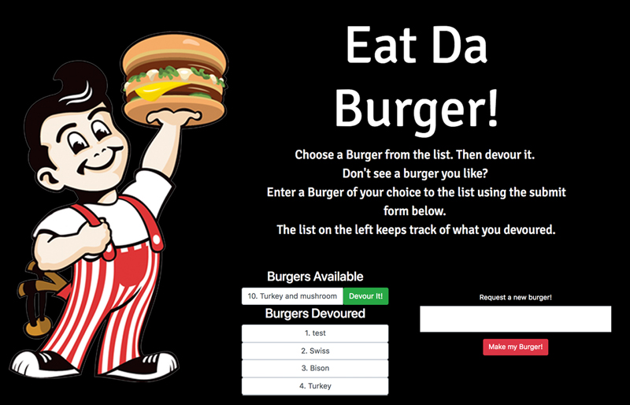

# Burger Application
## Overview
I created a burger logger with MySQL, Node, Express, Handlebars and a homemade ORM. Handlebars generated my HTML.

* Restaurant app that lets users input the names of burgers they'd like to eat.

* Whenever a user submits a burger's name,  app displays the burger on the left side of the page -- waiting to be devoured.

* Each burger in the waiting area also has a `Devour it!` button. When the user clicks it, the burger will move to the right side of the page.

* Stores every burger in a database, whether devoured or not.

## Home Page

---

## See it online at:
https://afternoon-plains-33371.herokuapp.com/index

---

## Technologies Used:

* Node

* Express

* Handlebars

* JQuery

* JavaScript

* npm packages: express, body-parser

---

## Author
Abby Thoresen copyright 2018
